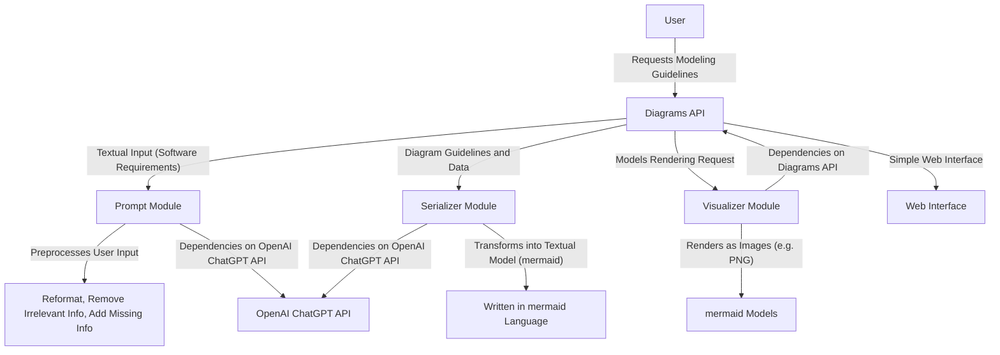

# diagram-viewer

## Sample usage

`diagram-viewer` can be consumed either as a service through a HTTP API, or as a standalone command line tool.

## Prompt Engineering

In order to optimize the quality of generated diagrams, we transform the input data by applying a combination of prompt patterns and increasing the probability of a desirable output. We compile a list of analyzed prompt patterns grouped into categories.

### Input Semantics

Identified patterns:

- Meta Language Creation

The first category of prompt patterns analyzed is *Input Semantics*. They define strategies for how a model should interpret (perhaps *parse* is a better word, hinting at the low level of abstraction at play) data provided by users. 

This category is realized by a class of prompt patterns called *Meta Language Creation*. Put simply, its aim is to define a custom language, which a LLM can deterministically interpret. In addition, the new language is not restricted to being a formal language either: modern LLMs can just as easily parse languages that are not well-defined.

Such patterns are useful for highly specialized use cases and when issues arise in the current model input language. Although we did not employ this pattern, the *Diagram Guideline* prompt element provided by *Diagrams API* does almost the exact opposite. By describing the *mermaid* modeling language, we are creating a LLM which can produce output belonging to a formal grammar language (in our case the mermaid language), essentially reversing the roles.

### Output Customization

- Output Automater
  - Works by defining a boundary between prompts that should be interpreted as automatable and those which should not e.g. by explaining to the LLM what conditions must be present for the task to be automated. The described prompt pattern is excellent for productivity and ease of use, however it poses little help in prompt analysis and optimizing requirement modeling. Furthermore, very little research is present on this specific pattern (and how it differs from another one). Search term `"output automater" AND ("LLM" OR "prompt engineering" OR "chatgpt")`
- Persona
  - This is a highly applicable pattern, which describes to the model how data should be interpreted and returned, based on the perspective the model is asked to assume. It is useful not only because of the close relationship between language and identity (useful when e.g. processing language of a specific style) but also because it hints to the model which elements of the prompt to focus and to what degree it should interpret them. We made use of this pattern and detail its use.
- Visualization Generator
  - With this pattern, models are presented with input data, which is then visualized either directly (by creating a raw image) or indirectly (by expressing the output in a way that can be deterministically visualized, most likely by another model or algorithm). This pattern is most common whenever it is easier to reason about input data when it is visualized, as is in our case. We employ this pattern together with X to define rules for modeling requirements with *mermaid*, which we can then visualize with any tool, including *Diagrams API*
- Recipe
  - This is one of the most common prompt patterns, which we all use either knowingly or unknowingly to some extent. The aim of this pattern is to manifest a concrete, ordered set of steps (loosely speaking a recipe) from given constraints and conditions (existing ingredients). This is great, because most times, specific steps is exactly what we require. However, modern LLMs are very sensitive to interpreting this prompt (whenever the user expresses the need for a solution or detailed explanation).
- Template
  - This is a highly universal prompt which defines how prompts should be constructed to obtain structured feedback (i.e. in a specific format that we're expecting). In theory, this means we can integrate the LLM with any software module with ease, because we can design prompts that reliably produce structured (with the schema we want) responses. Although we expect structured data (of certain modeling languages), the output variance is so great, that there isn't a static template we can force ChatGPT to use. We instead achieve this goal with examples and additional context/constraints 

### Error Identification

- Fact check
  -
- Reflection
  -
  
### Prompt Improvement

### Interaction

### Context Control